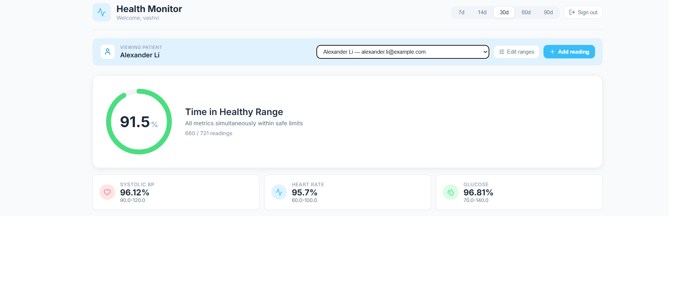
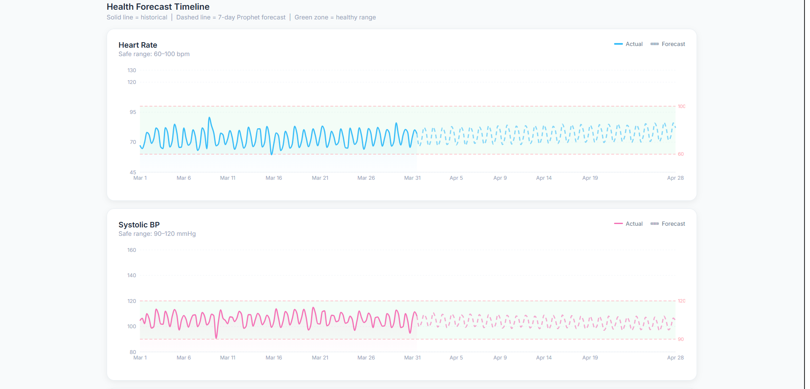
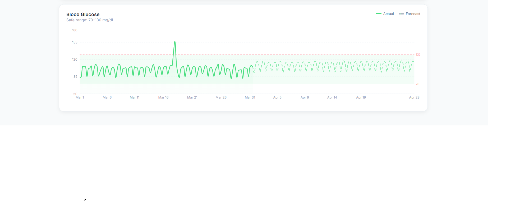

# Health Monitor — Patient Vitals Forecasting Platform

<!-- After pushing to GitHub, replace YOUR_USERNAME/YOUR_REPO below to activate the badge. -->
[](https://github.com/YOUR_USERNAME/YOUR_REPO/actions/workflows/ci.yml)

A full-stack clinical monitoring platform that tracks patient vital signs, forecasts
them 28 days ahead with **Facebook Prophet**, and flags patients drifting out of their
healthy range — backed by a **FastAPI** service and a **React** dashboard.

Built around a realistic synthetic cohort of **1,000 patients** with 90 days of hourly
history each, including the messy realities of hospital telemetry: sensor dropouts,
missing values, motion-artifact outliers, and data-entry errors.

> **Model status:** forecasting is **Prophet-only**. An LSTM comparison is a planned
> extension, not a current feature — see [Roadmap](#roadmap).

---

## Highlights

- **Validated forecasting, not hand-waving.** Every metric is backtested against a
  naive last-value baseline on all 1,000 patients (10-day horizon):

  | Metric | Prophet MAE | Baseline MAE | Improvement |
  |---|---|---|---|
  | Heart rate | 2.99 bpm | 7.01 bpm | **56.7%** |
  | Systolic BP | 4.26 mmHg | 8.91 mmHg | **52.1%** |
  | Diastolic BP | 3.90 mmHg | 6.63 mmHg | **41.6%** |
  | Glucose | 7.71 mg/dL | 19.68 mg/dL | **59.4%** |

  *(regenerate with `scripts/evaluate_forecast.py`)*

- **Production-shaped synthetic data.** Circadian rhythms, post-prandial glucose spikes,
  autocorrelated (AR(1)) sensor noise, age-correlated risk cohorts (healthy / at-risk /
  chronic), plus deliberately injected "dirty data" (~2% missing cells, multi-hour sensor
  dropouts, outliers, order-of-magnitude typos) to prove the pipeline doesn't crash on
  real-world input.
- **Self-healing forecasts.** New readings trigger a per-patient Prophet refit via FastAPI
  `BackgroundTasks`, so forecasts never go stale.
- **JWT-authenticated** doctor accounts (bcrypt password hashing) over an async
  **SQLAlchemy 2.0** data layer.

> **Sampling cadence.** Vitals are recorded at an **hourly** cadence — modeling
> nurse-charted ward vitals / hourly-aggregated remote monitoring. That's dense enough
> for the forecaster to learn circadian (day–night) patterns while staying tractable over
> 90 days of history. For readability the dashboard **down-samples to a 6-hour average**
> before charting, so the *stored* resolution (hourly) and the *displayed* resolution
> (6-hourly) differ by design.

---

## Architecture

```
┌─────────────────┐     /api (proxy)      ┌──────────────────────────┐
│  React + Vite   │ ────────────────────► │        FastAPI           │
│  Recharts UI    │ ◄──────────────────── │  auth · patients ·       │
│  (dashboard)    │      JSON + JWT       │  readings · dashboard    │
└─────────────────┘                       └──────────┬───────────────┘
                                                      │
                          ┌───────────────────────────┼───────────────────────┐
                          │                           │                       │
                  ┌───────▼────────┐         ┌────────▼────────┐     ┌────────▼────────┐
                  │ SQLAlchemy 2.0 │         │ Prophet         │     │ Analytics       │
                  │ (async SQLite) │         │ forecaster.py   │     │ TIHR / risk     │
                  └────────────────┘         └─────────────────┘     └─────────────────┘
```

**Backend layout** (`app/`)
- `routers/` — `auth`, `patients`, `readings`, `dashboard` endpoints
- `services/` — `forecaster.py` (Prophet), `tihr.py` (Time-in-Healthy-Range), `analytics.py`, `auth.py`
- `models/` — SQLAlchemy tables (`user`, `doctor`, `reading`, `healthy_range`)
- `schemas/` — Pydantic request/response models (None-safe for sensor dropouts)

**Data pipeline** (`scripts/`)
- `generate_synthetic_patients.py` — build the 1,000-patient cohort
- `train_real_forecasts.py` — fit Prophet per patient
- `evaluate_forecast.py` — backtest vs. naive baseline → `forecast_eval_summary.csv`
- `advance_synthetic_time.py` — roll histories forward to simulate live telemetry

---

## Quickstart

### Option A — Docker (one command)

**Requirements:** Docker + Docker Compose.

```bash
docker compose up --build
```

- Frontend → **http://localhost:8080**
- API docs → **http://localhost:8000/docs**

First boot generates a small synthetic cohort (50 patients by default — set
`N_PATIENTS` to change) into a persistent volume, then serves the API and the
built React app behind nginx. Register a doctor account in the UI to start.

### Option B — Local dev

**Requirements:** Python 3.11–3.14, Node 18+.

#### 1. Backend

```bash
python -m venv venv
# Windows: venv\Scripts\activate   |   macOS/Linux: source venv/bin/activate
pip install -r requirements-ml.txt      # API + Prophet (use requirements.txt for API only)

cp .env.example .env                     # then edit JWT_SECRET for anything non-local

# Generate the patient cohort + forecasts (data/ is gitignored, so build it once)
python scripts/generate_synthetic_patients.py
python scripts/train_real_forecasts.py --limit 50    # or omit --limit for all 1000
python scripts/evaluate_forecast.py                  # optional: model-performance card

uvicorn app.main:app --reload            # → http://127.0.0.1:8000  (docs at /docs)
```

The database and patient table are seeded automatically on first startup.

#### 2. Frontend

```bash
cd frontend
npm install
npm run dev                              # → http://localhost:5173 (proxies /api → :8000)
```

Register a doctor account in the UI, then browse the patient list and dashboards.

---

## Key API endpoints

| Method | Path | Purpose |
|---|---|---|
| `POST` | `/auth/register`, `/auth/login` | Doctor auth → JWT |
| `GET`  | `/patients/` | List patients |
| `POST` | `/patients/{id}/readings/quick` | Record vitals (triggers forecast refit) |
| `GET`  | `/dashboard/historical` | Resampled vitals history |
| `GET`  | `/dashboard/forecast-data` | 28-day forecast + risk levels |
| `GET`  | `/dashboard/model-performance` | Backtest accuracy vs. baseline |

Full interactive schema at `/docs` (Swagger UI).

---

## Testing

```bash
pip install -r requirements-dev.txt
pytest                 # full suite (Prophet smoke test included)
pytest -m "not ml"     # fast suite — no heavy ML deps (what CI runs)
```

38 tests covering the JWT auth flow, password hashing, Time-in-Healthy-Range math,
forecast risk classification, a Prophet refit smoke test, and **dirty-data resilience**
(proving the pipeline survives the injected NaNs, dropouts, and outliers). GitHub Actions
runs the fast suite plus a frontend lint/build on every push.

---

## Screenshots

**Patient dashboard — Time-in-Healthy-Range**
Per-patient overview: the share of readings where *all* vitals sit inside their safe
bands simultaneously, with a live breakdown per metric.



**Forecast timeline — actual vs. Prophet**
Solid line = recorded history, dashed line = Prophet forecast, green band = healthy range.





---

## Roadmap

- [x] Test suite (pytest) + GitHub Actions CI.
- [x] Dockerfile + docker-compose for one-command startup.
- [ ] **LSTM forecaster** as a second model, benchmarked head-to-head against Prophet.
- [ ] Dedicated sensor-ingest endpoint (`VitalsIngestSchema`) for direct device payloads.

---

## Notes

- This is a portfolio / educational project using **fully synthetic data** — it is not a
  medical device and must not be used for clinical decisions.
- Hard-pinned dependency versions were intentionally relaxed to version floors because
  hard pins fail to build on Python 3.14.
